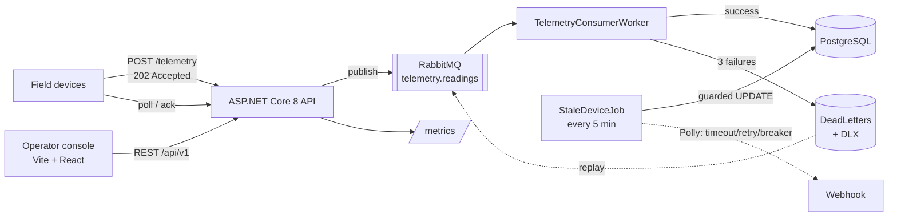

# Fleet Telemetry API

[](https://dotnet.microsoft.com/)
[](LICENSE)

High-volume IoT fleet telemetry: async ingest that never silently drops a reading, device lifecycle and commands, alerting, and an operator console with an in-browser device simulator.

**Live demo:** https://fleet-telemetry.vectur45.com


> **What this repository is.** This documents the design of a **private implementation**. The system is built, deployed and running — the demo above is live — but the source is not public. What you will find here: the design decisions with their rejected alternatives and costs, the architecture, the domain model, the API shape, and load-test scripts that run against the live deployment.
>
> Source access for hiring conversations is available on request.

---

## The problem

A fleet of field devices reports telemetry continuously. Three things make this harder than "write the reading to a table."

The **write path is the hot path**. Readings arrive constantly and each one is individually unimportant, but the stream as a whole is the product. If storing a reading is slow, every device waits on hardware that has no useful way to respond to back-pressure.

**Devices retry, and retries are not duplicates.** A reading that times out at the network layer may have been stored already. Send it again and any aggregate computed over that data is wrong.

**Silence is ambiguous.** A device that stops reporting might be broken, out of coverage, or switched off. Something has to decide, and it has to decide without fighting the ingest path for the same rows.

## Design decisions

Full write-ups in [`docs/adr/`](docs/adr/). The short version:

**[Ingest returns `202`, not `201`.](docs/adr/0001-202-accepted-tradeoff.md)** The API publishes to RabbitMQ and returns immediately; a consumer worker writes to PostgreSQL at its own pace. This decouples API latency from database latency. The cost is real and worth stating: a device cannot read its own write. That is acceptable because nothing in the device workflow does.

**[Failures are durable, not dropped.](docs/adr/0002-async-ingest-with-dead-letters.md)** Returning `202` means there is no open request to fail later, so failure needs somewhere to go. After three attempts the worker persists a `DeadLetter` row and nacks to the dead-letter exchange; operators inspect, replay or discard from the API or the console. Duplicates are rejected by a unique constraint on `(deviceId, idempotencyKey)` — in the schema, so it holds no matter how many consumers run.

**[A guarded conditional UPDATE fixes the stale-detection race.](docs/adr/0003-conditional-update-race-fix.md)** The background job reads a device at T1 and writes at T2; a reading arriving in between would get a live device marked inactive. The fix carries the value read at T1 into the `WHERE` clause of the write, so the database checks and updates atomically and the job skips anything that changed underneath it. No locks, so no deadlock.

**[The cache is in-process, and that limit is deliberate.](docs/adr/0004-in-process-cache-known-limit.md)** Fleet health is cached for 30 seconds with `IMemoryCache`. With two instances, each holds its own cache and they can disagree for up to a TTL. The correct fix at scale is Redis behind `IDistributedCache`; this project keeps the in-process version so the failure mode is observable rather than theoretical. The ADR says what it costs and how cheap the swap is.

**[Deploys come from version tags.](docs/adr/0005-gitea-cd-on-version-tags.md)** CI on every push; CD only on `v*` tags. Images carry both the commit SHA and `latest`, so rolling back is repointing a tag rather than rebuilding. Migrations run from a bundle under a separate migrator role — the running app has no DDL rights.

## Architecture



| Component | Responsibility |
|---|---|
| `TelemetryController` | Validates and publishes; never writes telemetry directly |
| `TelemetryConsumerWorker` | Drains the queue, writes readings, dead-letters on exhaustion |
| `StaleDeviceJob` | Marks lapsed devices inactive; optional webhook with Polly |
| `AdminDeadLettersController` | Inspect, replay, discard failed messages |
| `FleetTelemetryUI` | Operator console + device simulator, nginx-served SPA |

## Security model

Two tiers, because an operator and a device are not the same principal.

| Principal | Credential | May call |
|---|---|---|
| Operator | Shared `X-Api-Key` | Management routes and telemetry **reads** |
| Device | Per-device Bearer token | `POST .../telemetry`, `GET .../commands/pending`, `PUT .../commands/{id}/acknowledge` — and nothing else |

Device tokens are stored as SHA-256 hashes; the raw value is shown once at issue. Middleware additionally requires the authenticated device ID to match the `{deviceId}` in the route, so a valid token for device A cannot post as device B.

## Implementation

ASP.NET Core 8 · PostgreSQL + EF Core 8 (code-first migrations) · RabbitMQ · Polly (timeout, retry, circuit breaker) on the outbound stale-device webhook · Serilog → Seq · Prometheus at `/metrics` · Vite + React + TypeScript operator console served by nginx · CI/CD on Gitea Actions.

Roughly 97 C# files across the API and test projects, plus the operator console.

The console carries a **device simulator** — a separate Bearer-token persona that posts telemetry, polls for commands and acknowledges them. It is how the system is exercised end to end without flashing firmware, and it is what drives the live demo.

## API

The shape of the surface. Unlike the other two demos, these routes need a provisioned credential — an operator `X-Api-Key` for management and reads, a per-device Bearer token for ingest — so the console's built-in device simulator is the way to see them exercised.

Ingest a reading (device token):

```bash
curl -X POST https://fleet-telemetry.vectur45.com/api/v1/devices/{deviceId}/telemetry \
  -H 'Authorization: Bearer <device-token>' \
  -H 'Content-Type: application/json' \
  -d '{
        "recordedAt": "2026-09-22T10:00:00Z",
        "idempotencyKey": "reading-8f3c1e",
        "metrics": { "temperature_c": 41.2, "battery_pct": 88 }
      }'
```

```
HTTP/1.1 202 Accepted
X-Correlation-Id: 0f9c2a1e-...
```

Aggregate over a window (operator key):

```bash
curl 'https://fleet-telemetry.vectur45.com/api/v1/devices/{deviceId}/telemetry/aggregate?metric=temperature_c&bucket=1h&from=2026-09-21T00:00:00Z' \
  -H 'X-Api-Key: <operator-key>'
```

Replay a dead letter:

```bash
curl -X POST https://fleet-telemetry.vectur45.com/api/v1/admin/dead-letters/{id}/replay \
  -H 'X-Api-Key: <operator-key>'
```

Buckets are `1m` / `1h` / `1d` / `1w` / `1mo`. History supports pagination, time-range filtering, and streaming export as newline-delimited JSON.

## Testing

xUnit with Testcontainers against a **real PostgreSQL container**, not an in-memory provider — because the behaviour that matters here is database behaviour. The guarded conditional UPDATE in [ADR 0003](docs/adr/0003-conditional-update-race-fix.md) and the unique constraint in [ADR 0002](docs/adr/0002-async-ingest-with-dead-letters.md) would both pass against an in-memory provider while failing for real.

The console is covered by Vitest with Testing Library and MSW, and Playwright end-to-end journeys including axe accessibility checks.

**Not covered:** RabbitMQ broker failure mid-publish, and sustained multi-instance behaviour of the fleet-health cache (see [ADR 0004](docs/adr/0004-in-process-cache-known-limit.md)).

## Observability

Serilog structured logging to Seq, a correlation ID on every request (`X-Correlation-Id`, flowing into log scopes), Prometheus metrics at `/metrics`, and liveness/readiness probes that include a queue-depth signal — so a consumer falling behind is visible rather than discovered.

Starter Grafana dashboards are in `monitoring/grafana/dashboards/`.

## Load testing

See [`load/`](load/) for k6 scripts and published results, with the hardware each run was measured on.

## Source access

The implementation is private. If you are evaluating this for a role and want to read the code, ask and I will arrange access.

The design decisions in [`docs/adr/`](docs/adr/) are the substance of what the code does — each records what was chosen, what was rejected, and what it cost.

## Licence

The documentation in this repository is MIT — see [LICENSE](LICENSE).
